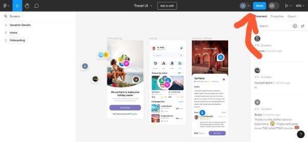
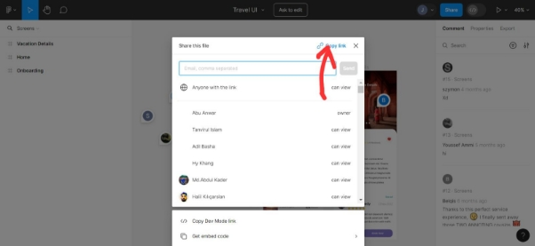
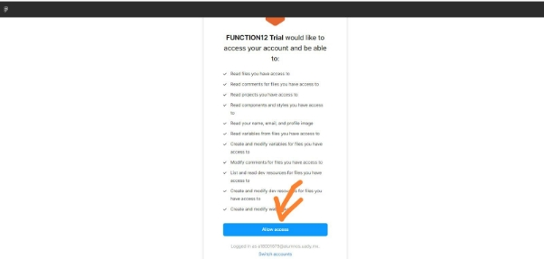
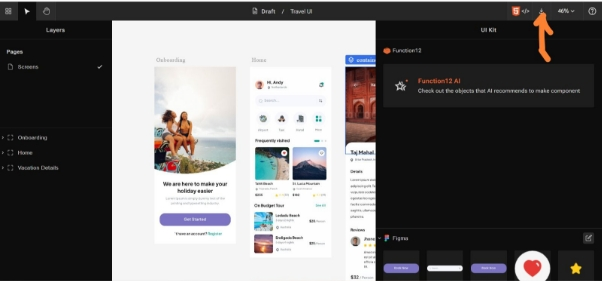
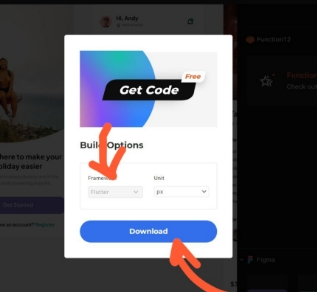
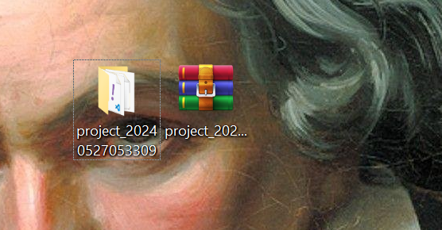

# Sesión Práctica

**Convertir diseño de Figma a código de Flutter**

**¿Qué es Figma?**

Figma es una herramienta de diseño que hace la vida de los diseñadores mucho más fácil y divertida. Piensa en Figma como un gran lienzo digital donde tú y tu equipo pueden trabajar juntos, sin importar dónde se encuentren.
### **¿Por qué Figma es Genial?**
1. **Trabajo en Equipo en Tiempo Real**: Imagina que estás ajustando un diseño y al mismo tiempo, tu colega en otra ciudad está añadiendo sus propias ideas. Todo sucede en tiempo real, sin tener que esperar a que te envíen actualizaciones por email.
1. **Prototipos Interactivos**: Puedes crear maquetas interactivas que muestran exactamente cómo funcionará tu diseño. Esto te permite probar y ajustar cosas antes de que se conviertan en código.
1. **Componentes Reutilizables**: Figma te permite crear y compartir elementos de diseño que puedes usar una y otra vez, asegurando que todo el equipo esté en la misma página y el diseño sea consistente.
1. **Conexiones con Otras Herramientas**: Figma se integra con aplicaciones que ya usas, como Slack y Jira, haciendo que todo tu flujo de trabajo sea más fluido y eficiente.
### **Beneficios Clave**
- **Accesibilidad desde Cualquier Lugar**: Puedes acceder a tus proyectos desde cualquier dispositivo con Internet, ya sea en casa, en la oficina o en un café.
- **Comunicación Directa y Clara**: Puedes dejar comentarios directamente en los diseños y ver las respuestas al instante, lo que hace que la colaboración sea mucho más fácil.
- **Siempre Actualizado**: Figma se actualiza automáticamente, así que siempre tienes acceso a las últimas funcionalidades sin tener que preocuparte por las instalaciones.

**¿Qué es Flutter?**

Flutter es un framework de desarrollo de software creado por Google, utilizado para construir aplicaciones nativas multiplataforma con una única base de código. Esto significa que puedes crear aplicaciones para iOS, Android, web y escritorio utilizando el mismo código fuente, lo que ahorra tiempo y recursos.
### **Características Principales de Flutter**
1. **Desarrollo Multiplataforma**: Permite a los desarrolladores escribir código una vez y desplegarlo en múltiples plataformas, incluyendo iOS, Android, web y aplicaciones de escritorio.
1. **Widget Personalizables**: Flutter proporciona una amplia colección de widgets personalizables que facilitan la creación de interfaces de usuario atractivas y nativas.
1. **Motor de Renderizado Propio**: Utiliza un motor gráfico propio que permite un alto rendimiento y gráficos suaves, lo cual es ideal para animaciones complejas y aplicaciones ricas en gráficos.
1. **Hot Reload**: Permite a los desarrolladores ver los cambios en tiempo real sin tener que reiniciar la aplicación, lo que acelera significativamente el proceso de desarrollo.

### **¿Para Qué se Usa Flutter?**
Flutter se utiliza para desarrollar aplicaciones móviles, web y de escritorio que necesitan ser rápidas, hermosas y altamente interactivas. Es especialmente útil para:

- **Aplicaciones Móviles**: Creación de aplicaciones nativas para iOS y Android con interfaces de usuario atractivas.
- **Aplicaciones Web**: Desarrollar aplicaciones web responsivas que funcionen en diferentes navegadores y dispositivos.
- **Aplicaciones de Escritorio**: Construcción de aplicaciones para Windows, macOS y Linux.
- **Prototipos y MVPs**: Desarrollo rápido de prototipos y productos mínimos viables (MVPs) para validar ideas de negocio rápidamente.

**Sesión Práctica:**

**Precondiciones para realizar la sesión práctica**

-Computadora con acceso a internet

-Cuenta en [Figma](https://www.figma.com/invites/auth?resource_type=team&email=juancaceb1%40gmail.com&is_not_gen_0=true)

-Crear una cuenta en [Function 12](https://fn12.com/)

-Descargar Flutter: (Link para tutorial de cómo descargar Flutter)

**Objetivo de la sesión práctica:**

En esta sesión práctica se mostrará el uso de una herramienta para traducir diseños estáticos de UI en Figma a código funcional en el framework Flutter. Esto con el objetivo de mostrarles a los estudiantes una forma de automatizar sus procesos de convertir su diseño a código.

**Paso 1: Crear UI en Figma**

Para esta sesión práctica utilizaremos el diseño que se encuentra en el siguiente dispositivo:

Figma Travel UI: [https://cutt.ly/H1uVoZJ](https://www.youtube.com/redirect?event=video_description&redir_token=QUFFLUhqbkxKZXZEa2VfTUYtSlFLbzhxd2MtbWtmTUtDZ3xBQ3Jtc0tsdzV5YnlxWDdTUkwyeUx6ZktnazNOQkEySWtMbUNIOEtpXzBYOU1xM3prcEw3aGY2dEJTRkNSVTJycVRSek9Gd1FLMWxMN0lpMFgzNFY0YjFoRkl5R2lONTFGWlZZamtpZlFQQ2MzSXd0SHFkMThEUQ&q=https%3A%2F%2Fcutt.ly%2FH1uVoZJ&v=hEVQch72TBo)

**Paso 2: Ingresar a FUNCTION 12**

Luego entraremos a la plataforma [Function 12](https://fn12.com/). Al entrar veremos la siguiente barra de búsqueda:

**Paso 3: Obtener el código en Flutter usando Function 12**

**Paso 3.1. Debemos dirigirnos a la pestaña donde tenemos abierto nuestro proyecto en Figma y copiar el link del proyecto**

**Paso 3.2: Pegar el link en la barra de búsqueda de Function 12 y hacer clic en Get Code For Free**

**Paso 3.4: Permitir Acceso de la cuenta de Figma**

**Paso 3.5: Esperar a que se procese el UI**

**Paso 3.6: Al final, debe dejarnos en la página principal de Function 12**

**Paso 4: Descargar el código en Flutter de Function 12**

**Paso 4.1: Hacer clic en el botón de descargar proyecto**

**Paso 4.2: Elegir la opción de Flutter y hacer clic en descargar**

**Paso 4.3: Se verá descargado el proyecto en el historial de descargas**

**Paso 5: Descomprimir el archivo .zip**

**Paso 6: Abrir el proyecto descomprimido en vs code**

### Paso 7: Resultado
Usando un emulador de Iphone 14 para mostrar cómo se tradujo la UI: El uso del emulador va más allá del objetivo de la sesión. Es solo para mostrar cómo se tradujo la interfaz de usuario al código.
![Emulador con el resultado
]
(https://raw.githubusercontent.com/Juanca1984/Registro-Ciudadanos/image.png
)
